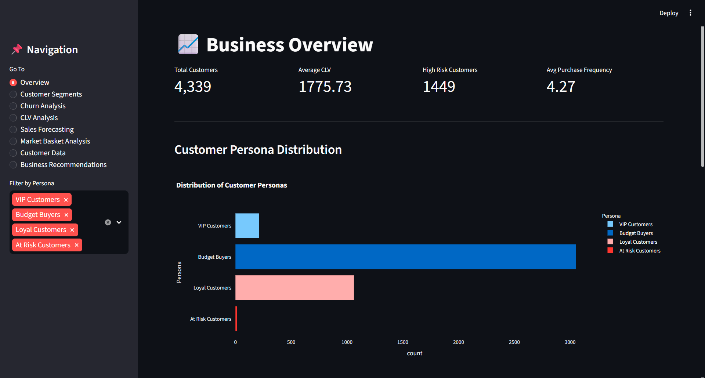
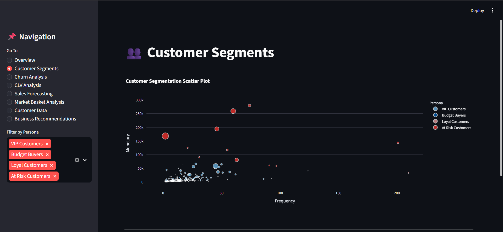
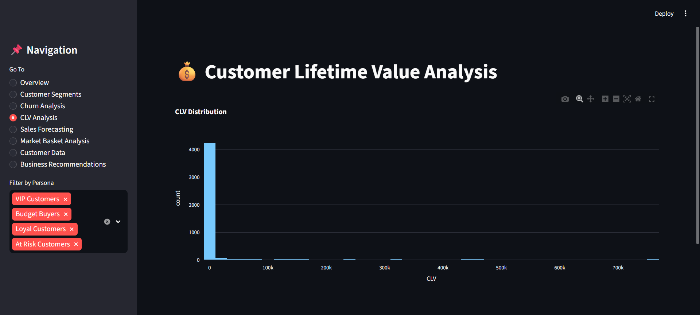
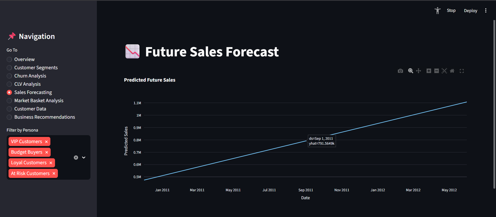

# 📊 E-Commerce Customer Segmentation & Retention Analysis

## 🚀 Project Overview

This project is an end-to-end customer analytics and retention intelligence system built using **Python, Machine Learning, and Streamlit**.

The goal of this project is to help e-commerce businesses:

* 🎯 Segment customers based on purchasing behavior
* ⚠️ Identify high-risk churn customers
* 💰 Estimate Customer Lifetime Value (CLV)
* 📈 Forecast future sales trends
* 🛒 Generate business recommendations

The project combines:

* Data Analysis
* Machine Learning
* Forecasting
* Visualization
* Interactive Dashboard Development

into a single business intelligence platform.

---

# 🧠 Business Problem

E-commerce businesses often struggle with:

* ❌ Customer churn
* ❌ Poor customer targeting
* ❌ Low retention rates
* ❌ Inefficient marketing strategies
* ❌ Revenue unpredictability

This project solves these problems using customer analytics and predictive insights.

---

# ✨ Features

## 👥 Customer Segmentation

* RFM (Recency, Frequency, Monetary) Analysis
* Customer Persona Engineering
* Customer Cluster Visualization

## ⚠️ Churn Analysis

* High-Risk Customer Detection
* Retention Insights
* Customer Risk Categorization

## 💰 Customer Lifetime Value (CLV)

* CLV Estimation
* Customer Value Distribution
* High-Value Customer Identification

## 📈 Sales Forecasting

* Future Revenue Prediction
* Trend Forecasting using Prophet
* Forecast Visualization

## 🛒 Market Basket Analysis

* Association Rule Mining
* Product Relationship Analysis
* Recommendation Insights

## 🎨 Interactive Dashboard

* Streamlit Dashboard
* Sidebar Navigation
* Interactive Visualizations
* Dynamic Filtering

---

# 🛠️ Tech Stack

### 👨‍💻 Programming & Analytics

* Python
* Pandas
* NumPy

### 🤖 Machine Learning

* Scikit-learn
* Prophet
* Mlxtend

### 📊 Visualization

* Plotly
* Matplotlib
* Seaborn

### 🌐 Dashboard Development

* Streamlit

---

# 🔬 Machine Learning & Analytics Techniques Used

* 📌 RFM Analysis
* 📌 Customer Persona Engineering
* 📌 Churn Risk Analysis
* 📌 Customer Lifetime Value (CLV)
* 📌 Time Series Forecasting
* 📌 Market Basket Analysis
* 📌 Association Rule Mining
* 📌 Interactive Dashboard Engineering

---

# 🖼️ Dashboard Preview

## 📌 Overview Dashboard



---

## 👥 Customer Segmentation



---

## 💰 CLV Analysis



---

## 📈 Forecasting Dashboard



---

# 📂 Project Structure

```bash
customer-segmentation-retention/
│
├── dashboard/
│   └── app.py
│
├── notebooks/
│   └── customer_segmentation.ipynb
│
├── outputs/
│   ├── customer_segments.csv
│   ├── sales_forecast.csv
│   └── association_rules.csv
│
├── screenshots/
│   ├── overview.png
│   ├── customer_segments.png
│   ├── clv_analysis.png
│   └── forecasting.png
│
├── requirements.txt
├── README.md
└── .gitignore
```

---

# ⚙️ Installation

## 🔽 Clone Repository

```bash
git clone https://github.com/jpsteve24/customer-segmentation-retention.git
```

---

## 📁 Navigate to Project

```bash
cd customer-segmentation-retention
```

---

## 📦 Install Dependencies

```bash
pip install -r requirements.txt
```

---

## ▶️ Run Streamlit Dashboard

```bash
streamlit run app.py
```

---

# 📊 Key Business Insights

* 🏆 VIP Customers contribute the highest revenue
* ⚠️ High-risk customers require retention strategies
* 💡 Personalized marketing improves retention
* 📈 Forecasting helps inventory and sales planning
* 🛒 Market basket analysis improves cross-selling opportunities

---

# 🔮 Future Improvements

* 🌐 Cloud Deployment
* 🤖 Advanced Recommendation Engine
* 🧠 Deep Learning-based Churn Prediction
* 🔄 Automated Retraining Pipelines
* 📡 Real-Time Customer Analytics
* 🔗 API Integration

---

# 📚 Key Learning Outcomes

This project helped in gaining practical experience in:

* ✅ End-to-End Data Science Workflow
* ✅ Customer Analytics
* ✅ Business Intelligence Systems
* ✅ Machine Learning Pipelines
* ✅ Dashboard Engineering
* ✅ Forecasting & Visualization
* ✅ Data Storytelling

---

# 👨‍💻 Author

## JP Steve Akash

📌 Data Science | Machine Learning | Analytics

---
---
## Dashboard Screenshots

### Overview Dashboard


### Customer Segmentation


### CLV Analysis


### Forecasting Dashboard

